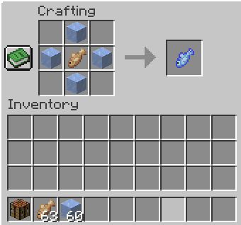
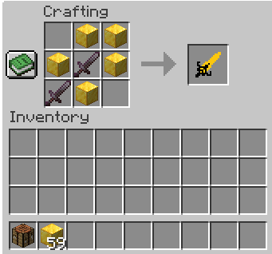
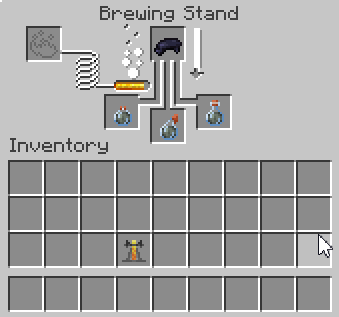

# Minecraft Rivals
A random collection of items themed after [Marvel Rivals, a 6v6 Hero Shooter themed with the Marvel Universe](https://www.marvelrivals.com/), 

This modpack includes `3` items:
- [Jeff's Frozen Spitball](#-jeffs-frozen-spitball)
- [Magik's Soulsword](#-magikss-soulsword)
- [Venom's Symbiote](#venoms-symbiote)

##  Jeff's Frozen Spitball

A food item that gives the player:
- `Conduit's Power` for `200 ticks`
- `Regeneration` for `100 ticks`

Crafting Recipe:

##  Magiks's Soulsword

A sword with `slow` speed but `high` damage

Crafting Recipe:

## Venom's Symbiote

A potion that gives the player:
- `Regeneration II` for `600 ticks`
- `Jump Boost II` for `600 ticks`
- `Health Boost II` for `1200 ticks`

Brewing Recipe (`black dye` + `Infested` potion):

